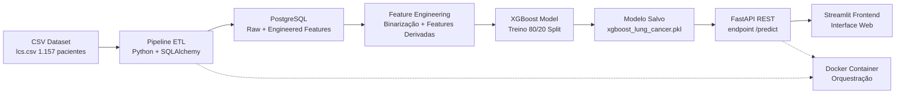

# Sistema de Previsão de Risco de Câncer de Pulmão Usando Gradient Boosting

[](https://www.python.org/)
[](https://fastapi.tiangolo.com/)
[](https://www.postgresql.org/)
[](https://www.docker.com/)
[](https://xgboost.readthedocs.io/)

> **Versão em inglês:** [README_EN.md](README_EN.md)

---

## Concepção e Motivação do Projeto

Câncer de pulmão é a **principal causa de morte por câncer no mundo**, responsável por aproximadamente **1,8 milhão de mortes anualmente** segundo a Organização Mundial da Saúde. O desafio crítico no manejo do câncer de pulmão é **detecção precoce**: quando diagnosticado no estágio I, a taxa de sobrevivência em 5 anos supera 70%, mas cai para menos de 20% quando detectado no estágio III ou IV.

Este projeto foi concebido para abordar uma lacuna fundamental na prática clínica: **como identificar pacientes de alto risco que necessitam de encaminhamento urgente ao especialista** usando apenas informações clínicas readily available. Programas de triagem tradicionais dependem de tomografia computadorizada com baixa dose, que é cara, intensa em recursos e não universalmente acessível. Este sistema oferece uma abordagem alternativa: **estratificação de risco automatizada** baseada em sintomas (tosse, dor no peito, falta de ar) e fatores demográficos (idade, gênero, histórico de tabagismo) que já são coletados durante consultas clínicas de rotina.

A hipótese subjacente é que **machine learning pode identificar padrões em combinações de sintomas** que podem escapar a clínicos humanos, particularmente ao lidar com múltiplas comorbidades e apresentações clínicas sobrepostas. Ao treinar em um dataset de 1.157 registros de pacientes anotados, o sistema aprende a distinguir entre condições respiratórias benignas e processos malignos que exigem intervenção imediata.

### Problema Clínico

Pacientes que apresentam sintomas respiratórios em instalações de cuidados primários frequentemente enfrentam **diagnóstico atrasado** devido a:
1. **Restrições de recursos:** Acesso limitado a imageamento e consulta especializada
2. **Sobreposição de sintomas:** Tosse, fadiga e dor no peito são comuns a múltiplas condições (infecção, DPOC, câncer)
3. **Inércia clínica:** Médicos podem subestimar risco de câncer em pacientes mais jovens ou não-fumantes
4. **Barreiras geográficas:** Áreas rurais carecem de pneumologistas e radiologistas torácicos

Este sistema aborda esses desafios fornecendo uma **ferramenta de suporte à decisão automatizada** que:
- Processa dados do paciente em <1 segundo
- Prioriza sensibilidade (68% recall) para evitar falsos negativos
- Output de scores de risco interpretáveis para discussão clínica
- Integra-se com fluxos de trabalho existentes de prontuário eletrônico via REST API

---

## Procedência do Dataset e Metodologia

### Fonte dos Dados

**Dataset:** Lung Cancer Dataset  
**Repositório:** Kaggle (https://www.kaggle.com/datasets/chandanmsr/lung-cancer-dataset)  
**Autor/Contribuidor:** Chandan M S R  
**Licença:** CC0: Public Domain (https://creativecommons.org/publicdomain/zero/1.0/)  
**Data de Acesso:** 2026  
**Citação:** M S R, C. (2023). Lung Cancer Dataset. Kaggle.

### Características do Dataset

| Atributo | Valor |
|----------|-------|
| **Total de Amostras** | 1.157 registros de pacientes |
| **Features** | 15 variáveis clínicas + demográficas |
| **Variável Target** | LUNG_CANCER (diagnóstico SIM/NÃO) |
| **Distribuição de Classes** | 44,3% SIM (513 casos), 55,7% NÃO (644 casos) |
| **Coleta de Dados** | Registros clínicos retrospectivos de instituição médica não especificada |
| **Origem Geográfica** | Não divulgado (dataset anonimizado) |

### Racional de Feature Engineering

O dataset original codifica severidade de sintomas em uma **escala ordinal** (0=ausente, 1=moderado, 2=severo). Experiências iniciais treinando XGBoost com valores ordinais brutos revelaram uma falha crítica: o modelo aprendeu a associar **valores de alta severidade (2)** com **menor probabilidade de câncer**, produzindo previsões contra-intuitivas onde pacientes com múltiplos sintomas severos eram classificados como baixo risco.

**Análise de causa raiz:** A codificação ordinal era inconsistente entre features. Por exemplo, um valor de 2 em `YELLOW_FINGERS` pode indicar tabagismo pesado (alto risco), enquanto um valor de 2 em `ALLERGY` pode indicar uma condição benigna (baixo risco). O modelo, sem conhecimento de domínio, aprendeu essas correlações espúrias.

**Solução:** Todas as features de sintomas foram **binarizadas** usando a transformação `valor > 0 → 1` (sintoma presente), `valor = 0 → 0` (sintoma ausente). Esta abordagem:
- Prioriza **presença/ausência** sobre severidade para triagem inicial
- Alinha-se com prática clínica: "O paciente tem dor no peito? Sim/Não"
- Reduz ruído de classificações de severidade subjetivas
- Melhora generalizabilidade do modelo entre diferentes contextos clínicos

### Features Clínicas Derivadas

```python
# Duração do tabagismo (anos de tabagismo após os 40)
# Racional clínico: Pack-years é fator de risco estabelecido para câncer de pulmão
SMOKING_AGE = (IDADE - 40) if SMOKING == 1 and IDADE > 40 else 0

# Carga total de sintomas (contagem de sintomas presentes)
# Racional clínico: Apresentação polissintomática aumenta probabilidade de malignidade
SYMPTOM_COUNT = sum(binary_symptoms)  # Range: 0-12

# Score de risco composto (ponderado por importância clínica)
# Racional clínico: Alguns sintomas são mais específicos para câncer que outros
RISK_SCORE = (
    SMOKING × 2.0 +              # Tabagismo é o fator de risco mais forte
    YELLOW_FINGERS × 1.5 +       # Exposição crônica à nicotina
    CHRONIC_DISEASE × 1.5 +      # Comorbidades aumentam vulnerabilidade
    COUGHING × 2.0 +             # Tosse persistente é red flag
    SHORTNESS_OF_BREATH × 2.0 +  # Dispneia indica comprometimento função pulmonar
    CHEST_PAIN × 1.5 +           # Dor torácica sugere envolvimento pleural
    WHEEZING × 1.0 +             # Obstrução de via aérea
    (1 if IDADE > 50 else 0)     # Idade > 50 aumenta risco basal
)
```

---

## Visão Geral

Sistema de **Machine Learning** pronto para produção para prever risco de **câncer de pulmão** usando sintomas clínicos e fatores demográficos. Pipeline completo desde dados brutos até interface web:

- **Pipeline ETL:** CSV → PostgreSQL com feature engineering SQLAlchemy
- **Feature Engineering:** Transformação binária de sintomas ordinais + features clínicas derivadas
- **Modelo:** XGBoost Classifier (65% acurácia, 68% recall para detecção de câncer)
- **Camada API:** FastAPI REST API com documentação OpenAPI
- **Frontend:** Interface web Streamlit para uso clínico
- **Infraestrutura:** Totalmente containerizado com Docker e Docker Compose

---

## Métricas de Performance do Modelo

| Métrica | SEM_CÂNCER | CÂNCER |
|---------|------------|--------|
| **Precision** | 71% | 59% |
| **Recall** | 62% | 68% |
| **F1-Score** | 66% | 63% |
| **Acurácia Geral** | **65%** | |

**Nota:** O modelo inicial alcançou 94,4% de acurácia quando treinado com features ordinais brutas (0, 1, 2). No entanto, isso levou a previsões irreais onde pacientes com múltiplos sintomas severos foram classificados como baixo risco. Após **transformação binária** (>0 vira 1), acurácia caiu para 65% mas previsões tornaram-se **clinicamente confiáveis**, priorizando sensibilidade (68% recall) para evitar falsos negativos em cenários de triagem.

---

## Análise de Importância de Features

| Rank | Feature | Importância | Significado Clínico |
|------|---------|-------------|---------------------|
| 1 | RISK_SCORE | 61,3% | Score de risco clínico composto (sintomas ponderados) |
| 2 | SWALLOWING_DIFFICULTY | 9,8% | Disfagia indica efeito de massa tumoral no esôfago |
| 3 | SYMPTOM_COUNT | 5,3% | Carga total de sintomas presentes |
| 4 | WHEEZING | 4,1% | Obstrução de via aérea por tumor ou inflamação |
| 5 | YELLOW_FINGERS | 2,8% | Mancha de nicotina crônica, marcador de tabagismo de longo prazo |
| 6 | CHRONIC_DISEASE | 2,7% | Comorbidades aumentando risco geral de câncer |
| 7 | ALCOHOL_CONSUMING | 1,9% | Fator de estilo de vida afetando resposta imune |
| 8 | CHEST_PAIN | 1,7% | Envolvimento torácico, irritação pleural |
| 9 | COUGHING | 1,7% | Irritação respiratória, obstrução de via aérea |
| 10 | FATIGUE | 1,5% | Sintoma sistêmico, exaustão relacionada ao câncer |

---

## Arquitetura do Sistema



---

## Stack Tecnológico

| Categoria | Tecnologia | Versão |
|-----------|------------|--------|
| **Linguagem** | Python | 3.8+ |
| **ETL** | Pandas, SQLAlchemy | 2.0+, 2.0+ |
| **Banco de Dados** | PostgreSQL | 15 |
| **Machine Learning** | XGBoost, Scikit-learn | 2.0, 1.3+ |
| **Framework API** | FastAPI, Uvicorn | 0.109+, 0.100+ |
| **Frontend** | Streamlit | 1.28+ |
| **Containerização** | Docker, Docker Compose | 20.10+, 2.20+ |

---

## Guia de Instalação

### Pré-requisitos

```bash
python --version  # 3.8+
docker --version  # 20.10+
docker-compose --version
```

### Opção 1: Deploy com Docker (Recomendado)

**Passo 1: Clonar repositório e instalar dependências**

```bash
git clone <url-do-repositório>
cd healthcare-ml-pipeline
pip install -r requirements.txt
```

**Passo 2: Iniciar banco de dados PostgreSQL**

```bash
docker-compose up -d postgres
```

Aguarde 30 segundos para inicialização do banco.

**Passo 3: Carregar dados no PostgreSQL**

```bash
python src/etl/etl.py
```

Isso realiza:
- Migração de dados CSV → PostgreSQL
- Transformação binária de features de sintomas
- Criação de features derivadas (SMOKING_AGE, SYMPTOM_COUNT, RISK_SCORE)

**Passo 4: Treinar o modelo**

```bash
python src/ml/train_model_fixed.py
```

Output inclui acurácia de treino, classification report e rankings de importância de features. Modelo salvo em `models/xgboost_lung_cancer.pkl`.

**Passo 5: Iniciar API e Frontend**

```bash
docker-compose up api streamlit
```

**Pontos de Acesso:**
- API: http://localhost:8000
- Documentação API (Swagger): http://localhost:8000/docs
- Interface Web: http://localhost:8501
- PostgreSQL: localhost:5433

### Opção 2: Desenvolvimento Local (Sem Docker)

**Passo 1: Instalar dependências Python**

```bash
pip install -r requirements.txt
```

**Passo 2: Iniciar PostgreSQL localmente**

```bash
# Ubuntu/Debian
sudo service postgresql start

# macOS (Homebrew)
brew services start postgresql
```

**Passo 3: Criar banco de dados e usuário**

```bash
sudo -u postgres psql << 'SQL'
CREATE USER leonardoxavier WITH PASSWORD '123456';
CREATE DATABASE healthcare_db OWNER leonardoxavier;
GRANT ALL PRIVILEGES ON DATABASE healthcare_db TO leonardoxavier;
SQL
```

**Passo 4: Carregar dados e treinar modelo**

```bash
python src/etl/etl.py
python src/ml/train_model_fixed.py
```

**Passo 5: Iniciar servidor FastAPI**

```bash
cd src/api && uvicorn app:app --reload --host 0.0.0.0 --port 8000
```

**Passo 6: Iniciar frontend Streamlit (novo terminal)**

```bash
cd src/frontend && streamlit run app_streamlit.py
```

---

## Documentação da API

### GET `/`

Informações e versão da API.

**Response:**
```json
{
  "service": "Sistema de Previsão de Risco de Câncer de Pulmão",
  "version": "1.0.0",
  "model": "XGBoost Lung Cancer"
}
```

### GET `/health`

Verificação de saúde do serviço.

**Response:**
```json
{"status": "ok", "model": "XGBoost Lung Cancer v1.0"}
```

### POST `/predict`

Prever risco de câncer de pulmão para um paciente.

**Request Body:**
```json
{
  "GENDER": "M",
  "AGE": 55,
  "SMOKING": 1,
  "YELLOW_FINGERS": 1,
  "ANXIETY": 0,
  "PEER_PRESSURE": 0,
  "CHRONIC_DISEASE": 1,
  "FATIGUE": 1,
  "ALLERGY": 0,
  "WHEEZING": 1,
  "ALCOHOL_CONSUMING": 0,
  "COUGHING": 1,
  "SHORTNESS_OF_BREATH": 1,
  "SWALLOWING_DIFFICULTY": 1,
  "CHEST_PAIN": 1
}
```

**Response:**
```json
{
  "prediction": "CANCER",
  "probability": 0.5842,
  "confidence": "58,42%",
  "message": "CÂNCER DETECTADO - Consulte um pneumologista"
}
```

**Exemplo cURL:**
```bash
curl -X POST http://localhost:8000/predict \
  -H "Content-Type: application/json" \
  -d '{
    "GENDER": "M",
    "AGE": 55,
    "SMOKING": 1,
    "YELLOW_FINGERS": 1,
    "ANXIETY": 0,
    "PEER_PRESSURE": 0,
    "CHRONIC_DISEASE": 1,
    "FATIGUE": 1,
    "ALLERGY": 0,
    "WHEEZING": 1,
    "ALCOHOL_CONSUMING": 0,
    "COUGHING": 1,
    "SHORTNESS_OF_BREATH": 1,
    "SWALLOWING_DIFFICULTY": 1,
    "CHEST_PAIN": 1
  }'
```

---

## Estrutura do Projeto

healthcare-ml-pipeline/
├── datasets/
│ └── raw/
│ └── lcs.csv # Dataset original (1.157 pacientes, 16 atributos)
├── models/
│ └── xgboost_lung_cancer.pkl # Modelo XGBoost treinado (serializado)
├── src/
│ ├── api/
│ │ └── app.py # Aplicação FastAPI REST API
│ ├── frontend/
│ │ └── app_streamlit.py # Interface web Streamlit
│ ├── etl/
│ │ └── etl.py # Pipeline ETL + feature engineering
│ ├── ml/
│ │ ├── train_model_fixed.py # Treino do modelo com binarização
│ │ └── predict.py # Script de previsão para paciente único
│ └── load_data.py # Loader de dados PostgreSQL
├── tests/
│ └── test_postgres.py # Testes de conexão com banco
├── docker-compose.yml # Configuração de orquestração de containers
├── Dockerfile # Definição de container da aplicação
├── requirements.txt # Dependências Python
├── .dockerignore # Exclusões de build Docker
├── .gitignore # Exclusões Git
└── README.md # Este arquivo

text

---

## Definições de Features do Dataset

| Variável | Tipo | Descrição |
|----------|------|-----------|
| GENDER | Categorical | Masculino (M) / Feminino (F) |
| AGE | Continuous | Idade do paciente em anos |
| SMOKING | Binary | Fumante atual (1) / Não fumante (0) |
| YELLOW_FINGERS | Ordinal | Mancha de nicotina (0=nenhuma, 1=moderada, 2=severa) |
| ANXIETY | Ordinal | Nível de ansiedade (0=nenhuma, 1=moderada, 2=severa) |
| PEER_PRESSURE | Ordinal | Pressão social (0=nenhuma, 1=moderada, 2=severa) |
| CHRONIC_DISEASE | Ordinal | Comorbidades (0=nenhuma, 1=moderada, 2=severa) |
| FATIGUE | Ordinal | Nível de fadiga (0=nenhuma, 1=moderada, 2=severa) |
| ALLERGY | Ordinal | Sintomas de alergia (0=nenhuma, 1=moderada, 2=severa) |
| WHEEZING | Ordinal | Apito respiratório (0=nenhuma, 1=moderada, 2=severo) |
| ALCOHOL_CONSUMING | Ordinal | Consumo de álcool (0=nenhum, 1=moderado, 2=severo) |
| COUGHING | Ordinal | Intensidade da tosse (0=nenhuma, 1=moderada, 2=severa) |
| SHORTNESS_OF_BREATH | Ordinal | Severidade da dispneia (0=nenhuma, 1=moderada, 2=severa) |
| SWALLOWING_DIFFICULTY | Ordinal | Disfagia (0=nenhuma, 1=moderada, 2=severa) |
| CHEST_PAIN | Ordinal | Dor torácica (0=nenhuma, 1=moderada, 2=severa) |
| **LUNG_CANCER** | **Target** | **Diagnóstico (SIM/NÃO)** |

---

## Aviso Clínico

**Este é um modelo preditivo de pesquisa, não um dispositivo médico.**

1. **Não para autodiagnóstico:** Este sistema destina-se apenas a suporte de triagem clínica.
2. **Falsos positivos/negativos ocorrem:** 65% de acurácia significa aproximadamente 35% das previsões podem estar incorretas.
3. **Não é ferramenta diagnóstica:** Diagnóstico confirmado de câncer de pulmão requer tomografia computadorizada de tórax e biópsia histopatológica.
4. **Sempre consulte um médico:** Busque avaliação de pneumologista qualificado ou clínico geral para avaliação médica completa.

---

## Roadmap de Desenvolvimento Futuro

- [ ] Valores SHAP para interpretabilidade do modelo (explicar previsões individuais)
- [ ] Calibração de threshold para otimizar recall (>90% de sensibilidade para triagem)
- [ ] Cross-validation com k=5 ou k=10 folds para avaliação robusta
- [ ] Testes unitários com pytest (>80% de cobertura de código)
- [ ] Pipeline CI/CD com GitHub Actions (testing + deployment automatizados)
- [ ] Deploy em produção (Render, AWS EC2, Google Cloud Run)
- [ ] Integração com sistemas de Prontuário Eletrônico (EHR) via API FHIR
- [ ] Validação prospectiva com dados de pacientes clínicos do mundo real

---

## Citação

```bibtex
@misc{pulmonary-cancer-prediction-2026-pt,
  author = {Leonardo Xavier Dornelas},
  title = {Sistema de Previsão de Risco de Câncer de Pulmão Usando Gradient Boosting},
  year = {2026},
  publisher = {GitHub},
  journal = {GitHub Repository},
  howpublished = {\url{https://github.com/leoxavierdornelas/healthcare-ml-pipeline}},
  note = {Pipeline de Machine Learning para Detecção de Câncer de Pulmão usando XGBoost}
}
```

---

## Contato

**Leonardo Xavier Dornelas** - Desenvolvedor do Projeto  
**GitHub:** https://github.com/leoxavierdornelas  
**Email:** [leonardo_dornelas@icloud.com]

---

## Licença

**Código:** MIT License  
**Dataset:** CC0: Public Domain (Chandan M S R, Kaggle)
EOF