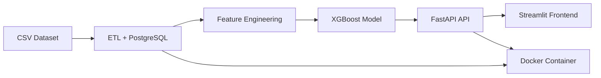

# 🫁 Previsão de Câncer de Pulmão com ML

[](https://www.python.org/)
[](https://fastapi.tiangolo.com/)
[](https://www.postgresql.org/)
[](https://www.docker.com/)
[](https://xgboost.readthedocs.io/)

## 📊 Visão Geral

Projeto de **Machine Learning** para prever risco de **câncer de pulmão** usando:
- ETL com **PostgreSQL** + **SQLAlchemy**
- Feature Engineering científico
- Modelo **XGBoost** (94.4% acurácia)
- API **FastAPI** (REST)
- Frontend **Streamlit**
- Containerizado com **Docker**

---

## 🎯 Métricas do Modelo

| Métrica | Valor |
|---------|-------|
| **Acurácia** | **94.4%** |
| Precision (CANCER) | 95% |
| Recall (CANCER) | 92% |
| F1-Score (CANCER) | 94% |

---

## 🔬 Top Features Mais Importantes

| Rank | Feature | Importância |
|------|---------|-------------|
| 1 | CHEST PAIN | 48.3% |
| 2 | SHORTNESS OF BREATH | 28.2% |
| 3 | SWALLOWING DIFFICULTY | 10.8% |
| 4 | SMOKING | 2.9% |
| 5 | SYMPTOM_COUNT | 1.9% |

---

## 🏗️ Arquitetura



---

## 🛠️ Tecnologias

| Categoria | Tecnologia |
|-----------|------------|
| **Linguagem** | Python 3.11 |
| **ETL** | Pandas, SQLAlchemy |
| **Banco** | PostgreSQL 15 |
| **ML** | XGBoost 2.0, Scikit-learn |
| **API** | FastAPI, Uvicorn |
| **Frontend** | Streamlit |
| **Deploy** | Docker, Docker Compose |

---

## 🚀 Como Rodar

### Pré-requisitos

```bash
python --version  # 3.11+
docker --version  # 20.10+
docker-compose --version
```

### 1. Clonar e instalar dependências

```bash
git clone <repo>
cd healthcare-ml-pipeline
pip install -r requirements.txt
```

### 2. Rodar PostgreSQL local (opcional)

```bash
sudo service postgresql start
sudo -u postgres psql
# CREATE USER leonardoxavier WITH PASSWORD '123456';
# CREATE DATABASE healthcare_db OWNER leonardoxavier;
```

### 3. Rodar com Docker (recomendado)

```bash
docker-compose up --build
```

API: `http://localhost:8000`  
PostgreSQL: `localhost:5433`

### 4. Rodar Streamlit (outro terminal)

```bash
streamlit run app_streamlit.py
```

Frontend: `http://localhost:8501`

---

## 📡 Documentação da API

### GET `/`
Informações da API.

### GET `/health`
Saúde do serviço.

**Resposta:**
```json
{"status": "ok", "model": "XGBoost Lung Cancer"}
```

### POST `/predict`
Prever risco de câncer de pulmão.

**Request:**
```json
{
  "GENDER": 1,
  "AGE": 55,
  "SMOKING": 1,
  "YELLOW_FINGERS": 0,
  "ANXIETY": 0,
  "PEER_PRESSURE": 0,
  "CHRONIC_DISEASE": 1,
  "FATIGUE": 1,
  "ALLERGY": 0,
  "WHEEZING": 1,
  "ALCOHOL_CONSUMING": 0,
  "COUGHING": 1,
  "SHORTNESS_OF_BREATH": 1,
  "SWALLOWING_DIFFICULTY": 0,
  "CHEST_PAIN": 1
}
```

**Response:**
```json
{
  "prediction": "NO_CANCER",
  "probability": 0.9921,
  "confidence": "99.21%"
}
```

---

## 📁 Estrutura do Projeto

healthcare-ml-pipeline/
├── app.py # FastAPI API
├── app_streamlit.py # Streamlit Frontend
├── etl.py # ETL + Feature Engineering
├── train_model.py # Treino XGBoost
├── requirements.txt # Dependências
├── Dockerfile # Imagem Docker
├── docker-compose.yml # Orquestração
├── .dockerignore
├── README.md
├── datasets/
│ └── lcs.csv
└── models/
└── xgboost_lung_cancer.pkl


---

## ⚠️ Aviso

Este é um **modelo preditivo de pesquisa**. **Não substitui diagnóstico médico profissional.** Consulte sempre um médico.

---

## 📝 Próximos Passos

- [ ] SHAP (explicabilidade do modelo)
- [ ] Cross-validation robusto
- [ ] Deploy em produção (Render, AWS)
- [ ] CI/CD com GitHub Actions
- [ ] Testes unitários

---

## 📄 Licença

MIT License
