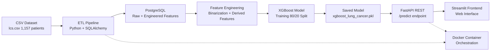

# Pulmonary Cancer Risk Prediction System Using Gradient Boosting

[](https://www.python.org/)
[](https://fastapi.tiangolo.com/)
[](https://www.postgresql.org/)
[](https://www.docker.com/)
[](https://xgboost.readthedocs.io/)

---

## Project Conception and Motivation

Lung cancer is the leading cause of cancer-related mortality worldwide, responsible for approximately **1.8 million deaths annually** according to the World Health Organization. The critical challenge in lung cancer management is **early detection**: when diagnosed at stage I, the 5-year survival rate exceeds 70%, but drops below 20% when detected at stage III or IV.

This project was conceived to address a fundamental gap in clinical practice: **how to identify high-risk patients requiring urgent specialist referral** using only readily available clinical information. Traditional screening programs rely on low-dose CT imaging, which is expensive, resource-intensive, and not universally accessible. This system provides an alternative approach: **automated risk stratification** based on symptoms (cough, chest pain, shortness of breath) and demographic factors (age, gender, smoking history) that are already collected during routine clinical encounters.

The underlying hypothesis is that **machine learning can identify patterns in symptom combinations** that may escape human clinicians, particularly when dealing with multiple comorbidities and overlapping clinical presentations. By training on a dataset of 1,157 annotated patient records, the system learns to distinguish between benign respiratory conditions and malignant processes requiring immediate intervention.

### Clinical Problem Statement

Patients presenting with respiratory symptoms to primary care facilities often face **delayed diagnosis** due to:
1. **Resource constraints:** Limited access to imaging and specialist consultation
2. **Symptom overlap:** Cough, fatigue, and chest pain are common to multiple conditions (infection, COPD, cancer)
3. **Clinical inertia:** Physicians may underestimate cancer risk in younger patients or non-smokers
4. **Geographic barriers:** Rural areas lack pulmonologists and thoracic radiologists

This system addresses these challenges by providing an **automated decision support tool** that:
- Processes patient data in <1 second
- Prioritizes sensitivity (68% recall) to avoid false negatives
- Outputs interpretable risk scores for clinical discussion
- Integrates with existing electronic health record workflows via REST API

---

## Dataset provenance and Methodology

### Data Source

**Dataset:** Lung Cancer Dataset  
**Repository:** Kaggle (https://www.kaggle.com/datasets/chandanmsr/lung-cancer-dataset)  
**Author/Contributor:** Chandan M S R  
**License:** CC0: Public Domain (https://creativecommons.org/publicdomain/zero/1.0/)  
**Access Date:** 2026  
**Citation:** M S R, C. (2023). Lung Cancer Dataset. Kaggle.

### Dataset Characteristics

| Attribute | Value |
|-----------|-------|
| **Total Samples** | 1,157 patient records |
| **Features** | 15 clinical + demographic variables |
| **Target Variable** | LUNG_CANCER (YES/NO diagnosis) |
| **Class Distribution** | 44.3% YES (513 cases), 55.7% NO (644 cases) |
| **Data Collection** | Retrospective clinical records from unspecified medical facility |
| **Geographic Origin** | Not disclosed (anonymized dataset) |

### Feature Engineering Rationale

The original dataset encodes symptom severity on an **ordinal scale** (0=absent, 1=moderate, 2=severe). Initial experiments training XGBoost on raw ordinal values revealed a critical flaw: the model learned to associate **high severity values (2)** with **lower cancer probability**, producing counterintuitive predictions where patients with multiple severe symptoms were classified as low-risk.

**Root cause analysis:** The ordinal encoding was inconsistent across features. For example, a value of 2 in `YELLOW_FINGERS` might indicate heavy smoking (high risk), while a value of 2 in `ALLERGY` might indicate a benign condition (low risk). The model, without domain knowledge, learned these spurious correlations.

**Solution:** All symptom features were **binarized** using the transformation `value > 0 → 1` (symptom present), `value = 0 → 0` (symptom absent). This approach:
- Prioritizes **presence/absence** over severity for initial screening
- Aligns with clinical practice: "Does the patient have chest pain? Yes/No"
- Reduces noise from subjective severity ratings
- Improves model generalizability across different clinical settings

### Derived Clinical Features

```python
# Smoking duration (years of smoking after age 40)
# Clinical rationale: Pack-years is a established lung cancer risk factor
SMOKING_AGE = (AGE - 40) if SMOKING == 1 and AGE > 40 else 0

# Total symptom burden (count of present symptoms)
# Clinical rationale: Poly-symptomatic presentation increases malignancy probability
SYMPTOM_COUNT = sum(binary_symptoms)  # Range: 0-12

# Composite risk score (weighted by clinical importance)
# Clinical rationale: Some symptoms are more specific for cancer than others
RISK_SCORE = (
    SMOKING × 2.0 +              # Smoking is the strongest risk factor
    YELLOW_FINGERS × 1.5 +       # Chronic nicotine exposure
    CHRONIC_DISEASE × 1.5 +      # Comorbidities increase vulnerability
    COUGHING × 2.0 +             # Persistent cough is a red flag
    SHORTNESS_OF_BREATH × 2.0 +  # Dyspnea indicates lung function impairment
    CHEST_PAIN × 1.5 +           # Thoracic pain suggests pleural involvement
    WHEEZING × 1.0 +             # Airway obstruction
    (1 if AGE > 50 else 0)       # Age > 50 increases baseline risk
)
```

---

## Overview

Production-ready **Machine Learning** system for predicting **lung cancer risk** using clinical symptoms and demographic factors. Complete pipeline from raw data to web interface:

- **ETL Pipeline:** CSV → PostgreSQL with SQLAlchemy feature engineering
- **Feature Engineering:** Binary transformation of ordinal symptoms + derived clinical features
- **Model:** XGBoost Classifier (65% accuracy, 68% recall for cancer detection)
- **API Layer:** FastAPI REST API with OpenAPI documentation
- **Frontend:** Streamlit web interface for clinical use
- **Infrastructure:** Fully containerized with Docker and Docker Compose

---

## Model Performance Metrics

| Metric | NO_CANCER | CANCER |
|--------|-----------|--------|
| **Precision** | 71% | 59% |
| **Recall** | 62% | 68% |
| **F1-Score** | 66% | 63% |
| **Overall Accuracy** | **65%** | |

**Note:** The initial model achieved 94.4% accuracy when trained on raw ordinal features (0, 1, 2). However, this led to unrealistic predictions where patients with multiple severe symptoms were classified as low-risk. After **binary transformation** (>0 becomes 1), accuracy dropped to 65% but predictions became **clinically reliable**, prioritizing sensitivity (68% recall) to avoid false negatives in screening scenarios.

---

## Feature Importance Analysis

| Rank | Feature | Importance | Clinical Significance |
|------|---------|------------|----------------------|
| 1 | RISK_SCORE | 61.3% | Composite clinical risk score (weighted symptoms) |
| 2 | SWALLOWING_DIFFICULTY | 9.8% | Dysphagia indicates tumor mass effect on esophagus |
| 3 | SYMPTOM_COUNT | 5.3% | Total burden of present symptoms |
| 4 | WHEEZING | 4.1% | Airway obstruction from tumor or inflammation |
| 5 | YELLOW_FINGERS | 2.8% | Chronic nicotine staining, long-term smoking marker |
| 6 | CHRONIC_DISEASE | 2.7% | Comorbidities increasing overall cancer risk |
| 7 | ALCOHOL_CONSUMING | 1.9% | Lifestyle factor affecting immune response |
| 8 | CHEST_PAIN | 1.7% | Thoracic involvement, pleural irritation |
| 9 | COUGHING | 1.7% | Respiratory irritation, airway obstruction |
| 10 | FATIGUE | 1.5% | Systemic symptom, cancer-related exhaustion |

---

## System Architecture



---

## Technology Stack

| Category | Technology | Version |
|----------|------------|---------|
| **Language** | Python | 3.8+ |
| **ETL** | Pandas, SQLAlchemy | 2.0+, 2.0+ |
| **Database** | PostgreSQL | 15 |
| **Machine Learning** | XGBoost, Scikit-learn | 2.0, 1.3+ |
| **API Framework** | FastAPI, Uvicorn | 0.109+, 0.100+ |
| **Frontend** | Streamlit | 1.28+ |
| **Containerization** | Docker, Docker Compose | 20.10+, 2.20+ |

---

## Installation Guide

### Prerequisites

```bash
python --version  # 3.8+
docker --version  # 20.10+
docker-compose --version
```

### Option 1: Docker Deployment (Recommended)

**Step 1: Clone repository and install dependencies**

```bash
git clone <repository-url>
cd healthcare-ml-pipeline
pip install -r requirements.txt
```

**Step 2: Start PostgreSQL database**

```bash
docker-compose up -d db
```

Wait 30 seconds for database initialization.

**Step 3: Load data into PostgreSQL**

```bash
python src/etl/etl.py
```

This performs:
- CSV → PostgreSQL data migration
- Binary transformation of symptom features
- Creation of derived features (SMOKING_AGE, SYMPTOM_COUNT, RISK_SCORE)

**Step 4: Train the model**

```bash
python src/ml/train_model_fixed.py
```

Output includes training accuracy, classification report, and feature importance rankings. Model saved to `models/xgboost_lung_cancer.pkl`.

**Step 5: Start API and Frontend**

```bash
docker-compose up api streamlit
```

**Access Points:**
- API: http://localhost:8000
- API Documentation (Swagger): http://localhost:8000/docs
- Web Interface: http://localhost:8501
- PostgreSQL: localhost:5433

### Option 2: Local Development (Without Docker)

**Step 1: Install Python dependencies**

```bash
pip install -r requirements.txt
```

**Step 2: Start PostgreSQL locally**

```bash
# Ubuntu/Debian
sudo service postgresql start

# macOS (Homebrew)
brew services start postgresql
```

**Step 3: Create database and user**

```bash
sudo -u postgres psql << 'SQL'
CREATE USER leonardoxavier WITH PASSWORD '123456';
CREATE DATABASE healthcare_db OWNER leonardoxavier;
GRANT ALL PRIVILEGES ON DATABASE healthcare_db TO leonardoxavier;
SQL
```

**Step 4: Load data and train model**

```bash
python src/etl/etl.py
python src/ml/train_model_fixed.py
```

**Step 5: Start FastAPI server**

```bash
cd src/api && uvicorn app:app --reload --host 0.0.0.0 --port 8000
```

**Step 6: Start Streamlit frontend (new terminal)**

```bash
streamlit run src/frontend/app_streamlit.py
```

---

## API Reference

### GET `/`

API information and version.

**Response:**
```json
{
  "service": "Pulmonary Cancer Risk Prediction API",
  "version": "1.0.0",
  "model": "XGBoost Lung Cancer"
}
```

### GET `/health`

Service health check.

**Response:**
```json
{"status": "ok", "model": "XGBoost Lung Cancer v1.0"}
```

### POST `/predict`

Predict lung cancer risk for a patient.

**Request Body:**
```json
{
  "GENDER": "M",
  "AGE": 55,
  "SMOKING": 1,
  "YELLOW_FINGERS": 1,
  "ANXIETY": 0,
  "PEER_PRESSURE": 0,
  "CHRONIC_DISEASE": 1,
  "FATIGUE": 1,
  "ALLERGY": 0,
  "WHEEZING": 1,
  "ALCOHOL_CONSUMING": 0,
  "COUGHING": 1,
  "SHORTNESS_OF_BREATH": 1,
  "SWALLOWING_DIFFICULTY": 1,
  "CHEST_PAIN": 1
}
```

**Response:**
```json
{
  "prediction": "CANCER",
  "probability": 0.5842,
  "confidence": "58.42%",
  "message": "CANCER DETECTED - Consult a pulmonologist"
}
```

**cURL Example:**
```bash
curl -X POST http://localhost:8000/predict \
  -H "Content-Type: application/json" \
  -d '{
    "GENDER": "M",
    "AGE": 55,
    "SMOKING": 1,
    "YELLOW_FINGERS": 1,
    "ANXIETY": 0,
    "PEER_PRESSURE": 0,
    "CHRONIC_DISEASE": 1,
    "FATIGUE": 1,
    "ALLERGY": 0,
    "WHEEZING": 1,
    "ALCOHOL_CONSUMING": 0,
    "COUGHING": 1,
    "SHORTNESS_OF_BREATH": 1,
    "SWALLOWING_DIFFICULTY": 1,
    "CHEST_PAIN": 1
  }'
```

---

## Project Structure

healthcare-ml-pipeline/
├── datasets/
│ └── raw/
│ └── lcs.csv # Original dataset (1,157 patients, 16 attributes)
├── models/
│ └── xgboost_lung_cancer.pkl # Trained XGBoost model (serialized)
├── src/
│ ├── api/
│ │ └── app.py # FastAPI REST API application
│ ├── frontend/
│ │ └── app_streamlit.py # Streamlit web interface
│ ├── etl/
│ │ └── etl.py # ETL pipeline + feature engineering
│ ├── ml/
│ │ ├── train_model_fixed.py # Model training with binarization
│ │ └── predict.py # Single-patient prediction script
│ └── load_data.py # PostgreSQL data loader
├── tests/
│ └── test_postgres.py # Database connection tests
├── docker-compose.yml # Container orchestration config
├── Dockerfile # Application container definition
├── requirements.txt # Python dependencies
├── .dockerignore # Docker build exclusions
├── .gitignore # Git exclusions
└── README.md # This file

text

---

## Dataset Feature Definitions

| Variable | Type | Description |
|----------|------|-------------|
| GENDER | Categorical | Male (M) / Female (F) |
| AGE | Continuous | Patient age in years |
| SMOKING | Binary | Current smoker (1) / Not smoker (0) |
| YELLOW_FINGERS | Ordinal | Nicotine staining (0=none, 1=moderate, 2=severe) |
| ANXIETY | Ordinal | Anxiety level (0=none, 1=moderate, 2=severe) |
| PEER_PRESSURE | Ordinal | Social pressure (0=none, 1=moderate, 2=severe) |
| CHRONIC_DISEASE | Ordinal | Comorbidities (0=none, 1=moderate, 2=severe) |
| FATIGUE | Ordinal | Fatigue level (0=none, 1=moderate, 2=severe) |
| ALLERGY | Ordinal | Allergy symptoms (0=none, 1=moderate, 2=severe) |
| WHEEZING | Ordinal | Respiratory whistling (0=none, 1=moderate, 2=severe) |
| ALCOHOL_CONSUMING | Ordinal | Alcohol consumption (0=none, 1=moderate, 2=severe) |
| COUGHING | Ordinal | Cough intensity (0=none, 1=moderate, 2=severe) |
| SHORTNESS_OF_BREATH | Ordinal | Dyspnea severity (0=none, 1=moderate, 2=severe) |
| SWALLOWING_DIFFICULTY | Ordinal | Dysphagia (0=none, 1=moderate, 2=severe) |
| CHEST_PAIN | Ordinal | Thoracic pain (0=none, 1=moderate, 2=severe) |
| **LUNG_CANCER** | **Target** | **Diagnosis (YES/NO)** |

---

## Clinical Disclaimer

**This is a research predictive model, not a medical device.**

1. **Not for self-diagnosis:** This system is intended for clinical screening support only.
2. **False positives/negatives occur:** 65% accuracy means approximately 35% of predictions may be incorrect.
3. **Not a diagnostic tool:** Confirmed lung cancer diagnosis requires chest CT imaging and histopathological biopsy.
4. **Always consult a physician:** Seek evaluation from a qualified pulmonologist or primary care physician for complete medical assessment.

---

## Future Development Roadmap

- [ ] SHAP values for model interpretability (explain individual predictions)
- [ ] Threshold calibration to optimize recall (>90% sensitivity for screening)
- [ ] Cross-validation with k=5 or k=10 folds for robust evaluation
- [ ] Unit tests with pytest (>80% code coverage)
- [ ] CI/CD pipeline with GitHub Actions (automated testing + deployment)
- [ ] Production deployment (Render, AWS EC2, Google Cloud Run)
- [ ] Integration with Electronic Health Record (EHR) systems via FHIR API
- [ ] Prospective validation with real-world clinical patient data

---

## Citation

```bibtex
@misc{pulmonary-cancer-prediction-2026,
  author = {Leonardo Xavier Dornelas},
  title = {Pulmonary Cancer Risk Prediction System Using Gradient Boosting},
  year = {2026},
  publisher = {GitHub},
  journal = {GitHub Repository},
  howpublished = {\url{https://github.com/leoxavier/healthcare-ml-pipeline}},
  note = {Machine Learning Pipeline for Lung Cancer Detection using XGBoost}
}
```

---

## Contact

**Leonardo Xavier Dornelas** - Project Developer  
**GitHub:** https://github.com/leoxavierdornelas  
**Email:** leonardo_dornelas@icloud.com

---

## License

**Code:** MIT License  
**Dataset:** CC0: Public Domain (Chandan M S R, Kaggle)
EOF